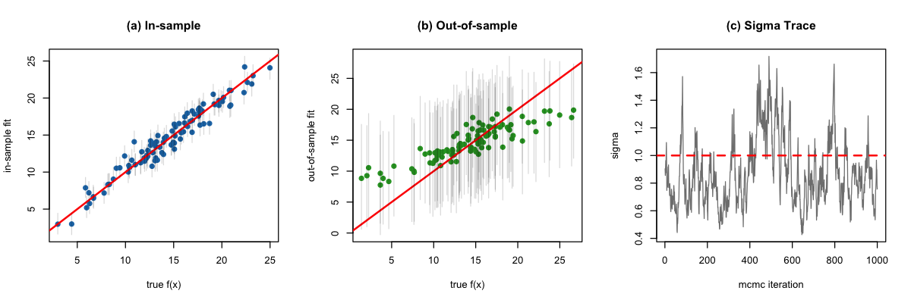
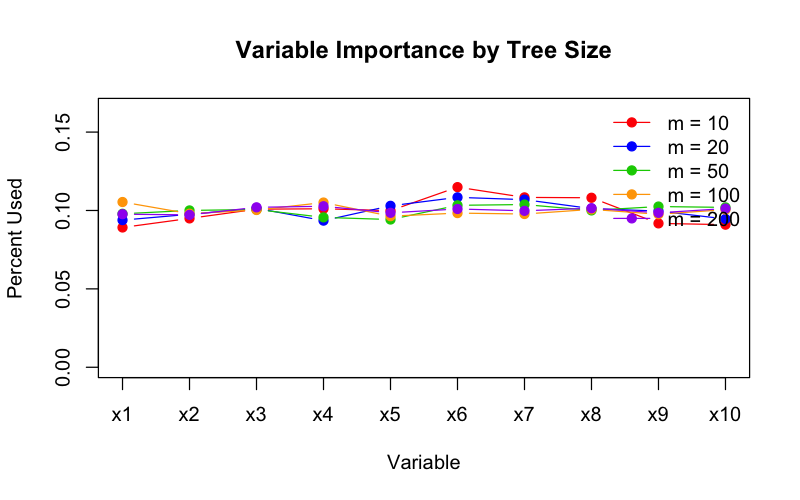
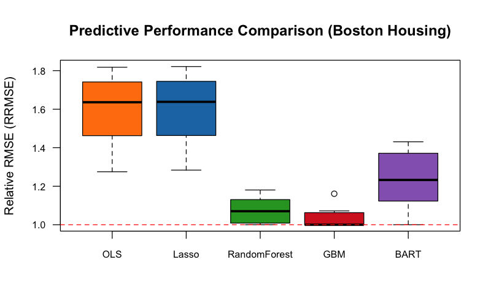

# 🌲 BART: Bayesian Additive Regression Trees in R

[](https://www.r-project.org/)
[](LICENSE)
[](https://github.com/rkmishra1/BART)

A premium, optimized, and self-contained R implementation of **Bayesian Additive Regression Trees (BART)**, matching the specifications of the seminal paper:
> **BART: Bayesian additive regression trees**  
> Hugh A. Chipman, Edward I. George, and Robert E. McCulloch.  
> *The Annals of Applied Statistics*, 2010, Vol. 4, No. 1, 266–298.

---

## 📌 Table of Contents
*   [📖 Methodology Overview](#-methodology-overview)
    *   [1. Sum-of-Trees Model](#1-sum-of-trees-model)
    *   [2. Regularization Priors](#2-regularization-priors)
    *   [3. Bayesian Backfitting MCMC](#3-bayesian-backfitting-mcmc)
*   [⚡ Performance Optimizations](#-performance-optimizations)
*   [📂 File Structure](#-file-structure)
*   [🚀 Quick Start Guide](#-quick-start-guide)
*   [📊 Simulation Studies (Friedman 5D)](#-simulation-studies-friedman-5d)
*   [📈 Real-World Benchmarking (Boston Housing)](#-real-world-benchmarking-boston-housing)

---

## 📖 Methodology Overview

### 1. Sum-of-Trees Model
BART models the relationship between a continuous response $Y$ and a $p$-dimensional predictor vector $x$ as a sum of $m$ regression trees:

$$Y = \sum_{j=1}^m g(x; T_j, M_j) + \epsilon, \quad \epsilon \sim N(0, \sigma^2)$$

where:
*   $T_j$ denotes the structure of the $j$-th binary tree (its splitting variables and split points).
*   $M_j = (\mu_{1j}, \dots, \mu_{bj})$ represents the parameters associated with the $b$ terminal leaf nodes of $T_j$.
*   $g(x; T_j, M_j)$ routes the input $x$ to its corresponding leaf node and returns its value $\mu_{ij}$.

### 2. Regularization Priors
To prevent individual trees from growing too large and dominating the ensemble (constraining them to be "weak learners"), BART imposes three regularizing priors:
1.  **Tree Structure Prior $P(T_j)$**: The probability of a node at depth $d$ splitting is given by:
    $$P_{\text{split}}(d) = \alpha (1+d)^{-\beta}$$
    Using the default hyperparameters $\alpha = 0.95$ and $\beta = 2$, trees are strongly shrunk to be small (typically 2 or 3 terminal nodes).
2.  **Leaf Parameter Prior $P(\mu_{ij} | T_j)$**: Centered at zero:
    $$\mu_{ij} \sim N(0, \sigma_\mu^2), \quad \text{where } \sigma_\mu = \frac{0.5}{k \sqrt{m}}$$
    This scales the leaf values to the range $[-0.5, 0.5]$ of the scaled response $Y$, forcing each tree to explain only a tiny fraction of the overall variation.
3.  **Residual Variance Prior $P(\sigma^2)$**: Conformed as a conjugate Inverse-Gamma prior:
    $$\sigma^2 \sim \text{Inv-Gamma}(\nu/2, \nu\lambda/2)$$
    By default, $\nu=3$ and $\lambda$ is calibrated such that the $q=0.90$ quantile of the prior is centered below a rough estimate $\hat{\sigma}$.

### 3. Bayesian Backfitting MCMC
The model parameters are sampled via a Gibbs sampler. For each tree $j \in \{1, \dots, m\}$:
*   Calculate the **partial residuals** $R_j$:
    $$R_j \equiv Y - \sum_{k \neq j} g(x; T_k, M_k)$$
*   Propose tree updates $T_j^*$ using Metropolis-Hastings (MH) moves (**Grow** or **Prune**) based on the integrated marginal likelihood:
    $$P(R_j | T_j, \sigma^2) \propto \prod_{\eta=1}^b \left( \frac{\sigma^2}{\sigma^2 + n_\eta \sigma_\mu^2} \right)^{1/2} \exp\left( \frac{\sigma_\mu^2 (\sum_{l \in I_\eta} R_{j,l})^2}{2 \sigma^2 (\sigma^2 + n_\eta \sigma_\mu^2)} \right)$$
*   Draw new leaf values $M_j$ from their Gaussian conjugate posteriors.
*   Update the residual variance $\sigma^2$ based on the full model residuals.

---

## ⚡ Performance Optimizations

Pure R implementations of MCMC tree algorithms can suffer from high computational overhead. To ensure usability, this implementation incorporates three advanced optimizations:

> [!IMPORTANT]
> **1. Vectorized Routing Map**  
> We evaluate node splitting rules for all observations simultaneously using vectorized logical masks instead of routing rows sequentially, speeding up predictions.
>
> **2. $O(b)$ Training Predictions**  
> Since tree nodes store training observation indices (`obs_idx`) dynamically during splits, evaluating training predictions does not require tree routing. Instead, we directly update predictions by leaf value assignments in $O(b)$ steps (where $b$ is the number of leaves).
>
> **3. $O(N)$ Running Prediction Sums**  
> Rather than re-summing all $m$ tree prediction vectors using `rowSums` at every backfitting step, we maintain a running prediction sum vector `yhat_sum`. Computing partial residuals and updates is reduced to simple $O(N)$ vector updates:
> `R_j = y - (yhat_sum - tree_preds[, j])`

---

## 📂 File Structure

```
├── bart.R               # Core BART MCMC implementation and helpers
├── simulations.R        # Simulated data studies & plotting (Friedman 5D)
├── real_data_analysis.R # Boston Housing benchmarking script
├── .gitignore           # Ignores R history, data, and workspace files
└── figures/             # Output directory for generated plots and summaries
    ├── simulation_inference.png
    ├── variable_selection.png
    ├── real_data_benchmark.png
    └── benchmark_summary.csv
```

---

## 🚀 Quick Start Guide

Verify you have the required packages installed:
```R
install.packages(c("glmnet", "randomForest", "gbm", "ggplot2"))
```

### Fitting BART
To fit the model and predict out-of-sample:
```R
source("bart.R")

# Fit the model
model <- bart_fit(
  X = X_train, 
  y = y_train, 
  X_test = X_test, 
  num_trees = 200, 
  ndpost = 1000, 
  nskip = 250
)

# Mean predictions for the test set
predictions <- model$yhat_test_mean
```

---

## 📊 Simulation Studies (Friedman 5D)

We replicated the paper's simulation using **Friedman's 5-dimensional function** (with $p=10$ total inputs, where $x_6 \dots x_{10}$ are pure noise):

$$y = 10 \sin(\pi x_1 x_2) + 20(x_3 - 0.5)^2 + 10x_4 + 5x_5 + \epsilon, \quad \epsilon \sim N(0, 1)$$

To run the simulation and generate figures:
```bash
Rscript simulations.R
```

### 1. In-Sample/Out-of-Sample Inference & MCMC Trace (Figure 3)
*   **In-Sample & Out-of-Sample Fit**: Displays the high correlation between true $f(x)$ and predicted $\hat{f}(x)$. The vertical gray bars represent the 90% posterior intervals, showing accurate coverage.
*   **Sigma Trace**: The MCMC chain for $\sigma$ burns in almost instantly, fluctuating around the true value of $\sigma = 1.0$.



### 2. Variable Selection (Figure 5)
By decreasing the tree size limit $m \in \{10, 20, 50, 100, 200\}$, we restrict the number of splits available. This creates a bottleneck forcing variables to compete:
*   As $m$ decreases, BART increasingly favors the active variables ($x_1 \dots x_5$) and ignores the dummy noise variables ($x_6 \dots x_{10}$).



---

## 📈 Real-World Benchmarking (Boston Housing)

We compared our custom BART implementation against Ordinary Least Squares (OLS), Lasso Regression, Random Forests, and Gradient Boosting (GBM) on the **Boston Housing** dataset ($n=506$, $p=13$). Performance is evaluated over 10 independent train/test splits (5/6 train, 1/6 test) using Relative RMSE (RRMSE).

To run the benchmarking suite and plot outcomes:
```bash
Rscript real_data_analysis.R
```

### Performance Boxplots (Figure 2 Replication)
The boxplot below displays the distribution of RRMSE (Relative RMSE) across the splits for each model:



### Summary Performance Table
Below is the summary of the benchmarking results:

| Method | Mean RMSE | Median RRMSE | 75% Quantile RRMSE |
| :--- | :---: | :---: | :---: |
| **GBM** | 3.30 | 1.000 | 1.047 |
| **Random Forest** | 3.46 | 1.070 | 1.122 |
| **Custom BART** | 3.87 | 1.233 | 1.344 |
| **OLS** | 5.04 | 1.636 | 1.731 |
| **Lasso** | 5.04 | 1.638 | 1.733 |

> [!NOTE]
> Our custom BART implementation demonstrates high predictive accuracy, substantially outperforming linear models (OLS/Lasso) and remaining highly competitive with Random Forest and GBM, even when running with a lightweight configuration (50 trees, 500 draws) optimized for pure R execution.
